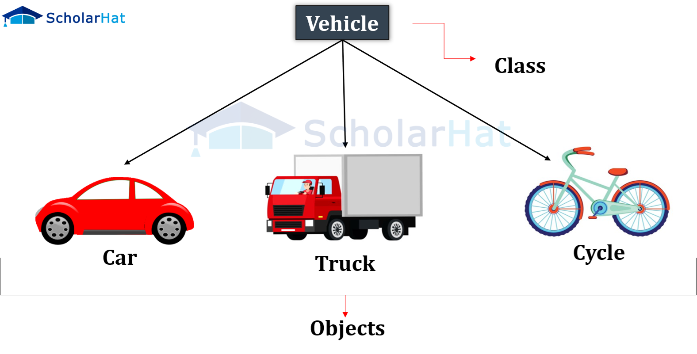
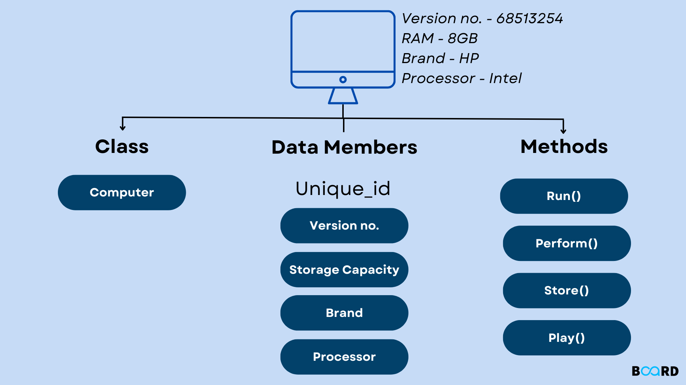
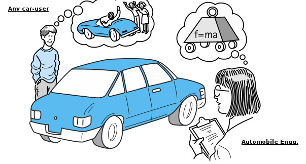
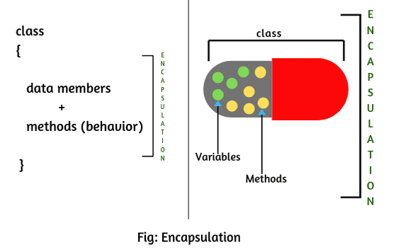
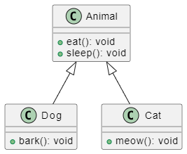
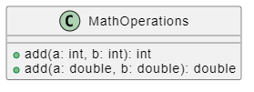
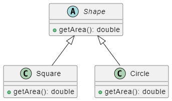

# Tugas Pertemuan 2 - Konsep OOP
Nama: I Kadek Arya Deva Artana<br /> 
NRP: 5025231157<br />
Kelas: Pemrograman Berbasis Objek A

<hr>

### 1. Class
Class adalah bluprint dari sebuah object yang merupakan tipe data yang ditentukan oleh user. Class berisi data(variable) dan fungsi yang merepresentasikan object nantinya.



Contoh program:
``` java
public class Mahasiswa {
    private String nama;
    private String nrp;
    private int angkatan;

    public void tampilkanInfo() {
        System.out.println("Nama: " + nama);
        System.out.println("NRP: " + nrp);
        System.out.println("Angkatan: " + angkatan);
    }
}
```

### 2. Object
Object adalah class yang sudah memiliki data dan menjadi entitas yang asli. Object berisikan beberapa hal utama, seperti:
- State: attribut dari object 
- Behavior: direpresentasikan oleh method yang dimiliki
- Identity: nama unik yang dimiliki object
- Method: fungsi pada class



Contoh program:
``` java
public class Mahasiswa {
    private String nama;
    private String nrp;
    private int angkatan;

    // Constructor
    public Mahasiswa(String nama, String nrp, int angkatan) {
        this.nama = nama;
        this.nrp = nrp;
        this.angkatan = angkatan;
    }

    public void tampilkanInfo() {
        System.out.println("Nama: " + nama);
        System.out.println("NRP: " + nrp);
        System.out.println("Angkatan: " + angkatan);
    }

    // Main program
    public static void main(String[] args) {
        // Membuat object mahasiswa
        Mahasiswa mhs = new Mahasiswa("I Kadek Arya Deva Artana", "5025231157", 2023);

        // Menampilkan data mahasiswa
        mhs.tampilkanInfo();
    }
}
```

Output(isi object):
```
Nama: I Kadek Arya Deva Artana
NRP: 5025231157
Angkatan: 2023
```

### 3. Data Abstraction
Data abstraction adalah proses menyembunyikan implementasi data atau fungsi dan hanya menampilkan data atau fungsi yang penting untuk user. Tujuan data abstraction adalah untuk mengurangi kompleksitas untuk user nantinya.




### 4. Encapsulation
Encapsulation adalah proses membukus data dan method dalam satu unit. Data di dalam class dapat disembunyikan dan hanya dapat diakses melalui method di dalam class.




### 5. Inheritance
Inheritance adalah mekanisme agar suatu class dapat mewarisi data dan methods yang dimiliki class lain.



### 6. Polymorphism
Polymorphism adalah kemampuan objek untuk memiliki lebih dari satu bentuk, yaitu objek yang sama dapat digunakan dengan cara yang berbeda. Dalam polymorphism sendiri diapat dilakukan saat compile-time(overloading) dan runtime(overriding).

- Overloading <br />



- Overriding <br />


Contoh program untuk konsep data abstraction, encapsulation, inheretance, overloading, dan overriding.
```java
// Abstract class
abstract class Mahasiswa {
    public String nama;
    public String nrp;
    public int angkatan;
    
    // Encapsulation dengan membuat data menjadi private, hanya method dalam class yang bisa 
    // ngambil data
    private boolean lulus;
    

    // Constructor
    public Mahasiswa(String nama, String nrp, int angkatan, boolean lulus) {
        this.nama = nama;
        this.nrp = nrp;
        this.angkatan = angkatan;
        this.lulus = lulus;
    }

    public void tampilkanInfo() {
        System.out.println("Nama: " + nama);
        System.out.println("NRP: " + nrp);
        System.out.println("Angkatan: " + angkatan);
    }
    
    // Encapsulation: method yang bisa ngambil data private
    public String isLulus() {
        return (lulus) ? "Lulus" : "Belum lulus";
    }
    
    // Polymorphism(Overloading)
    public void tampilkanInfo(boolean all){
        System.out.println("Nama: " + nama);
        System.out.println("NRP: " + nrp);
        System.out.println("Angkatan: " + angkatan);
        System.out.println("Status kelulusan: " + isLulus());
    }
    
}

// Inheritance
class MahasiswaSistemInformasi extends Mahasiswa {
    // Constructor manggil punya class asli
    public MahasiswaSistemInformasi(String nama, String nrp, int angkatan, boolean lulus) {
        super(nama, nrp, angkatan, lulus);
    }

    // Polymorphism(Overriding)
    @Override public void tampilkanInfo() {
        super.tampilkanInfo();
        System.out.println("Jurusan: Sistem Informasi");
    }
    @Override public void tampilkanInfo(boolean all) {
        super.tampilkanInfo(all);
        System.out.println("Jurusan: Sistem Informasi");
    }
}

// Inheritance
class MahasiswaInformatika extends Mahasiswa {
    // Constructor manggil punya class asli
    public MahasiswaInformatika(String nama, String nrp, int angkatan, boolean lulus) {
        super(nama, nrp, angkatan, lulus);
    }

    // Polymorphism(Overriding)
    @Override public void tampilkanInfo() {
        super.tampilkanInfo();
        System.out.println("Jurusan: Teknik Informatika");
    }
    @Override public void tampilkanInfo(boolean all) {
        super.tampilkanInfo(all);
        System.out.println("Jurusan: Teknik Informatika");
    }
}

public class Main {
    public static void main(String[] args) {
        // Pembuatan object berdasarkan subclass
        Mahasiswa mahasiswaSI = new MahasiswaSistemInformasi("Kadek Arya", "5025231157", 2023, true);
        Mahasiswa mahasiswaTI = new MahasiswaInformatika("Deva Artana", "5025231100", 2023, false);

        // Hasil overriding
        System.out.println("Hasil overriding");
        System.out.println("Data subclass Sistem Informasi");
        mahasiswaSI.tampilkanInfo();
        System.out.println("\nData subclass Teknik Informatika");
        mahasiswaTI.tampilkanInfo();
        
        //Hasil overloading
        System.out.println("\nHasil overloading");
        mahasiswaSI.tampilkanInfo(true);
        
        // Encapsulation
        System.out.println("\nHasil pemanggilan private data dengan method dalam class ");
        System.out.println(mahasiswaSI.nama + ": " + mahasiswaSI.isLulus());
        System.out.println(mahasiswaTI.nama + ": " + mahasiswaTI.isLulus());
    }
}
```

Output program:
```
Hasil overridin
Data subclass Sistem Informasi
Nama: Kadek Arya
NRP: 5025231157
Angkatan: 2023
Jurusan: Sistem Informasi

Data subclass Teknik Informatika
Nama: Deva Artana
NRP: 5025231100
Angkatan: 2023
Jurusan: Teknik Informatika

Hasil overloading
Nama: Kadek Arya
NRP: 5025231157
Angkatan: 2023
Status kelulusan: Lulus
Jurusan: Sistem Informasi

Hasil pemanggilan private data dengan method dalam class 
Kadek Arya: Lulus
Deva Artana: Belum lulus
```

